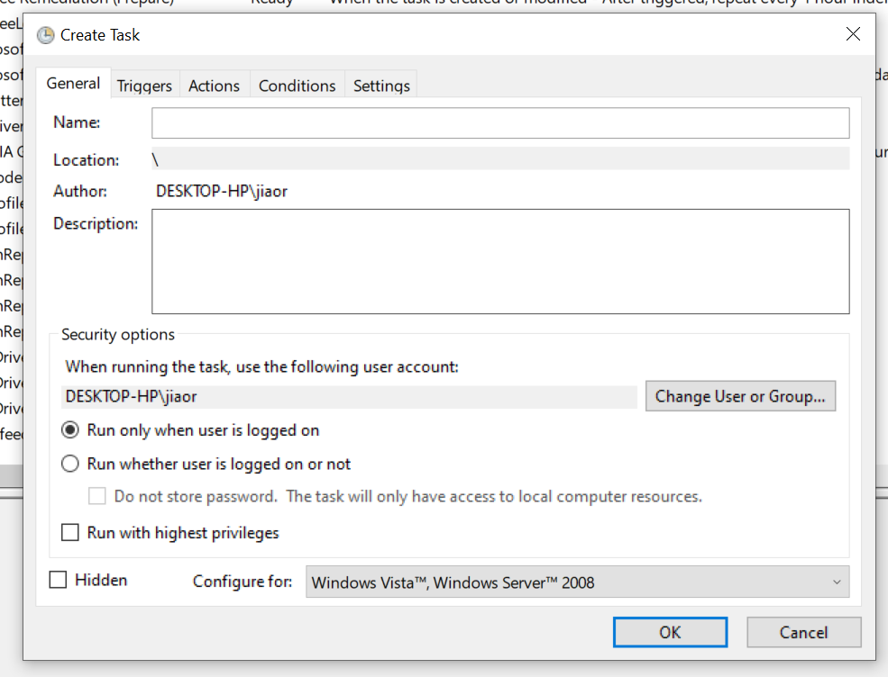
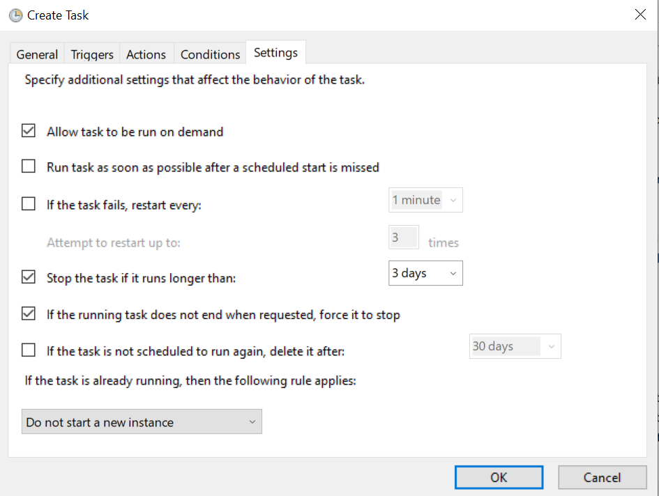

# How to set a task for Automating Unit Tests in Python

For simply set up the automatic task (Running Python/C/MATLAB)We will need the following：

[Task Scheduler] =&gt; [.bat] =&gt; [Python Script]

|Item|Details|More info.|
| -----------------------------| ------------------------------------------------------------------------------------------------------------------------------------------------------------------------------------------------------------------------------------------------------------------------------------------------------------------------| -------------------------------------------------------|
|@1Prepare[Python script]|An executable[Pythonscript]|/|
|@2[.bat]for[python scripts]|@echo off "Path where your Python exe is  stored\python.exe" "Path where your Python script is  stored\script_name.py" pause   @echo off "C:\Users\lenovo\AppData\Local\Programs\Python\Python39" "C:\Users\lenovo\PycharmProjects\pythonProject_HP\Python-Abaqus  API Project\Python-Abaqus API\Refer_Tutorial" pause|Steps to Create a  Batch File to Run a Python Script [https://datatofish.com/batch-python-script/](https://datatofish.com/batch-python-script/)|
|@3 Task setting for[.bat]|[Task Scheduler]: 'Create  New Task' => General  (task description)=> Triggers  (time schedule)=> Actions  (Where you put the .bat in) => Conditions  => Others|From  <[https://www.windowscentral.com/how-create-automated-task-using-task-scheduler-windows-10](https://www.windowscentral.com/how-create-automated-task-using-task-scheduler-windows-10)>|
|@4 for[MATLAB]?|Is there a way to use  a ".bat" file to call a MATLAB script from a MATLAB command line  without the bat file opening up a new MATLAB session?|[https://www.mathworks.com/matlabcentral/answers/115020-is-there-a-way-to-use-a-bat-file-to-call-a-matlab-script-from-a-matlab-command-line-without-the-b](https://www.mathworks.com/matlabcentral/answers/115020-is-there-a-way-to-use-a-bat-file-to-call-a-matlab-script-from-a-matlab-command-line-without-the-b)|

| To find the right python.exe ​   ​                                                                                                                                                               |
|------------------------------------------------------------------------------------------------------------------------------------------------------------------------------------------------------------------------------------------------------------------------------------------|
| [Task Scheduler]: 'Create New Task' =>  General(task description)=> Triggers(time schedule)=>Actions(Where you  put the .bat in) => Conditions => Others                                                                                                                                 |
| ​​​               ​ |

