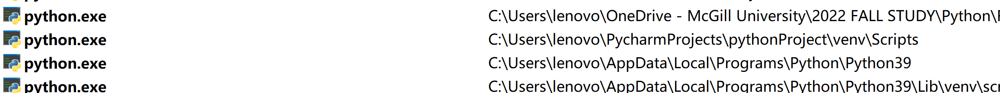
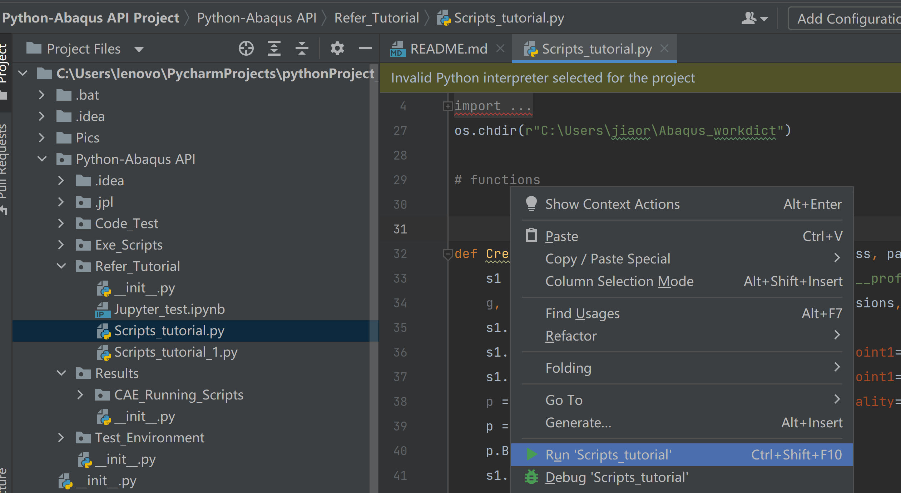
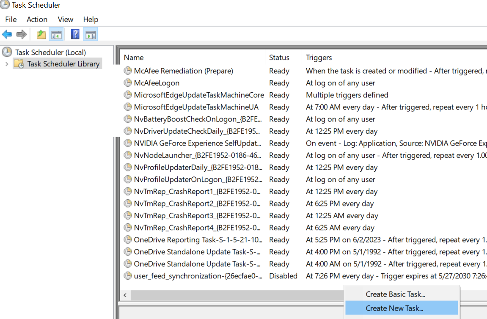
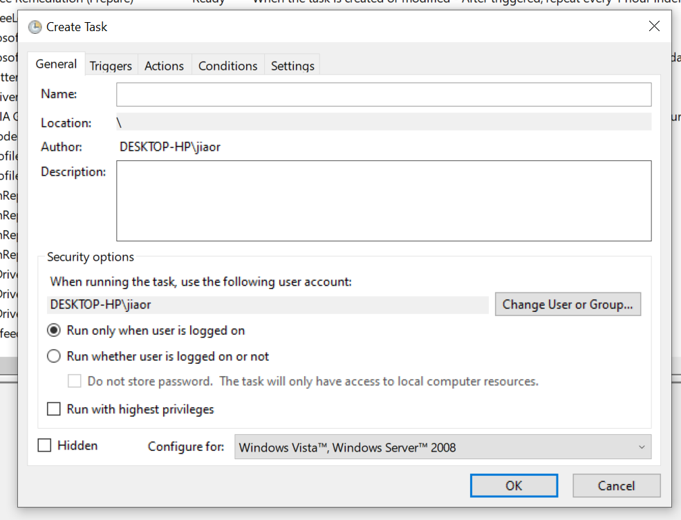
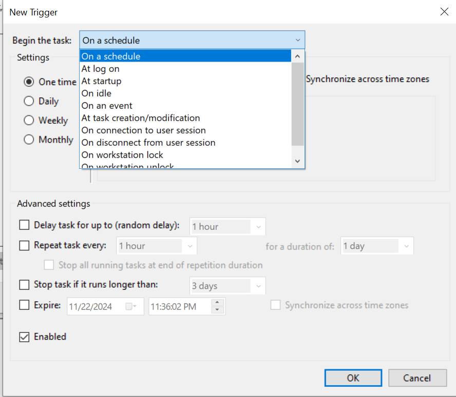
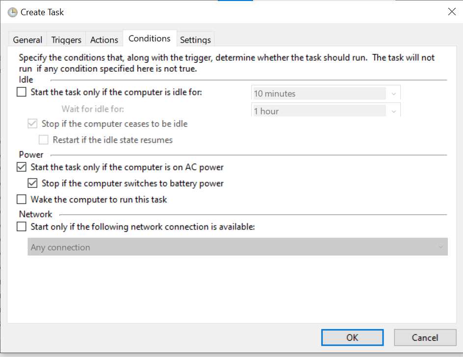
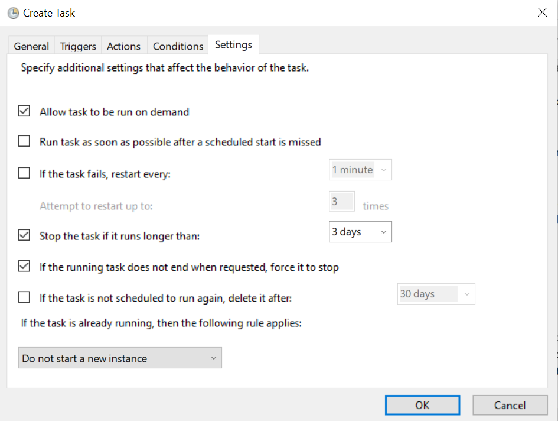

**[intro]
Hi~!!! This is a tutorial about how to using the Python-Abaqus API to automatically create/analysis**

[Pycharm: how to soft wrap~]

From <https://blog.csdn.net/GeekLeee/article/details/73658311>

[refer CAE modeling:]
https://www.martinpletz.com/fe-scripting/

[Abaqus Handbook]:
http://130.149.89.49:2080/v2016/books/ker/default.html
http://130.149.89.49:2080/v2016/books/cmd/default.htm?startat=pt01ch01.html
http://130.149.89.49:2080/v6.11/pdf_books/SCRIPT_USER.pdf

[Video]:
[1] https://www.youtube.com/watch?v=FbPBj7B4cKA

[code refer]:

https://github.com/hnrwagner/ABAQUS-Python-Script/blob/main/Script_3D_cylinder_002.py
https://github.com/hnrwagner/ABAQUS-Python-Script/blob/main/Script_3D_cylinder_004.py

[2] https://www.youtube.com/watch?v=QRQLliaOpm4

Project deployment, Please refer to https://github.com/JiaoranWang/Python-Abaqus.git
The original .PDF of this file is here: https://jiaoranwang.github.io/home/Abaqus-Python%20API%20Operation%20Manual.html
https://github.com/JiaoranWang/jiaoranwang.github.io/blob/master/home/pdf/Abaqus-Python%20API%20Operation%20Manual.pdf
The abaqus modeling file mentioned is here: 
(.ppt): 
https://github.com/JiaoranWang/Python-Abaqus/blob/master/Python-Abaqus%20API%20Project/Pics/3%20abaqus%20tutorial.pdf
(.mp4)
Abaqus Simulation Tutorial

Project deployment, Please refer to https://github.com/JiaoranWang/Python-Abaqus.git
The original .PDF of this file is here: https://jiaoranwang.github.io/home/Abaqus-Python%20API%20Operation%20Manual.html
https://github.com/JiaoranWang/jiaoranwang.github.io/blob/master/home/pdf/Abaqus-Python%20API%20Operation%20Manual.pdf
The abaqus modeling file mentioned is here: 
(.ppt): 
https://github.com/JiaoranWang/Python-Abaqus/blob/master/Python-Abaqus%20API%20Project/Pics/3%20abaqus%20tutorial.pdf
(.mp4)

**Abaqus Simulation Tutorial**
**1.intro**

Abaqus can automatically generate Python script files with the extension.rpy, it's automatically tracking all the oprations in the CAE inerface. When the task ends, the scripts are saved into .jnl, you can run the file to rebuild the model 

The "abaqus.rpy" can be automatically updatedaccording to action (checked in notebook++ and Pycharm)
By changing the parameters and process in it, we can obtain a new model with new job and analysis.

To be noticed that CAE can only run the plain python scripts in its run shell, which means that:

1) Python scripts that have judgment statements (because prespace changes are not recognized) 
and 2) reference functions defined in the same file (CAE does not redirect to relative pathlookup) are not allowed to be imported into CAE to run
=> 3) Any references, function definitions and variable inputs need to be in the same script

2. Running Python scripts in Abaqus
2.1 Function structure and specification

For now, we have the following scripts:Please see the following pic

1.Environment
1.1 Abaqus Environment: How do I automatically run scripts in Abaqus

Firstly we need to check where the 'Abaqus Command' window are.
	C:\ProgramData\Microsoft\Windows\Start Menu\Programs\Dassault Systemes SIMULIA Established Products 2021

My path is in C:\ProgramData\Microsoft\Windows\Start Menu\Programs\Dassault Systemes SIMULIA Established Products 2021 =>  "Abaqus Command.lnk"

The .lnk is the suffix for shortcut, to trace back to the original file, we can right click, then click on the 'Open file location'
(How do I find the normal location of the shortcut?
https://m33.wiki/help/windows_shortcut_original_file_location.html)

The original file is a CMD, so we can open it in Python and type input by feeding .bat file
[Strongly suggestion] Since the .lnk could function well, we can put it directly into the folder where we calling it to avoid path changing (see the following pic)

Enter the Command in the Abaqus Command window:
''
Cd C:\Users\jiaor\PycharmProjects\pythonProject_HP\Python-Abaqus API Project\Python-Abaqus API\Exe_Scripts
abaqus cae script=Exe_1.py
''
I put them into a .bat file

To directly put the path into abaqus cae script could not work:
abaqus cae script=C:\Users\jiaor\PycharmProjects\pythonProject_HP\Python-Abaqus API Project\Python-Abaqus API\Exe_Scripts\Exe_1.py

Execute Scripts

# How to set a task for Automating Unit Tests in Python

For simply set up the automatic task (Running Python/C/MATLAB)We will need the following：

[Task Scheduler] =&gt; [.bat] =&gt; [Python Script]

|Item|Details|More info.|
| -----------------------------| ------------------------------------------------------------------------------------------------------------------------------------------------------------------------------------------------------------------------------------------------------------------------------------------------------------------------| -------------------------------------------------------|
|@1Prepare[Python script]|An executable[Pythonscript]|/|
|@2[.bat]for[python scripts]|@echo off "Path where your Python exe is  stored\python.exe" "Path where your Python script is  stored\script_name.py" pause   @echo off "C:\Users\lenovo\AppData\Local\Programs\Python\Python39" "C:\Users\lenovo\PycharmProjects\pythonProject_HP\Python-Abaqus  API Project\Python-Abaqus API\Refer_Tutorial" pause|Steps to Create a  Batch File to Run a Python Script [https://datatofish.com/batch-python-script/](https://datatofish.com/batch-python-script/)|
|@3 Task setting for[.bat]|[Task Scheduler]: 'Create  New Task' => General  (task description)=> Triggers  (time schedule)=> Actions  (Where you put the .bat in) => Conditions  => Others|From  <[https://www.windowscentral.com/how-create-automated-task-using-task-scheduler-windows-10](https://www.windowscentral.com/how-create-automated-task-using-task-scheduler-windows-10)>|
|@4 for[MATLAB]?|Is there a way to use  a ".bat" file to call a MATLAB script from a MATLAB command line  without the bat file opening up a new MATLAB session?|[https://www.mathworks.com/matlabcentral/answers/115020-is-there-a-way-to-use-a-bat-file-to-call-a-matlab-script-from-a-matlab-command-line-without-the-b](https://www.mathworks.com/matlabcentral/answers/115020-is-there-a-way-to-use-a-bat-file-to-call-a-matlab-script-from-a-matlab-command-line-without-the-b)|

| To find the right python.exe ​   ​                                                                                                                                                               |
|------------------------------------------------------------------------------------------------------------------------------------------------------------------------------------------------------------------------------------------------------------------------------------------|
| [Task Scheduler]: 'Create New Task' =>  General(task description)=> Triggers(time schedule)=>Actions(Where you  put the .bat in) => Conditions => Others                                                                                                                                 |
| ​​​               ​ |

‍
![[Python-Abaqus API Project]\Pics\img_2.png]([Python-Abaqus API Project]/Pics/img_2.png)