# What does [Python-Abaqus API Project] do?

# [**Intro.]**

> **Hi~!!! This is a tutorial about how to using the Python-Abaqus API to automatically create/analysis**
>
> Project deployment, Please refer to [https://github.com/JiaoranWang/Python-Abaqus.git](https://github.com/JiaoranWang/Python-Abaqus.git)

> In this tutorial, I will show you how to create an Abaqus Model using Python scripts.

# [Python-Abaqus API Project] Code Operation Manual

|Contents||
| ---------------------------------------| ---------------------------------------------------------------------------------------------------------------------------------------------------------------------------------------------------------------------------------|
|1.Introduction|1.1 How  does the abaqus built a model? [.rpy => .jnl] 1.2 things  to remember while writing the .py file 1.3 How to  create a model(Manually) in Abaqus|
|2.Environment|2.1  Abaqus Environment:Howto  find the 'Abaqus Command' window to execute the .rpy scripts 2.2 EASY!  Just put 'Abaqus Command' in your execute folder|
|3. Running  Python scripts in Abaqus|3.1Function structure and specification  3.2  Execute:Open [Abaqus Comman.lnk] and run the .py  script  3.3  Results: Storage  3.4  Updates! How to  select different execute scripts .py without re-write the runcae.bat? |
|4.Trimming  your modeling scripts .py||
|5.Export  the data from Abaqus||

You can download the original .PDF of this file here:

​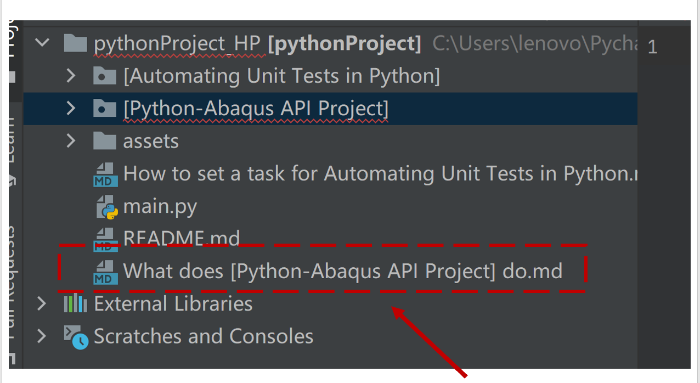​

## 1.introduction

​​

### 1.1 How does the abaqus built a model? [.rpy => .jnl]

Abaqus can automatically generate Python script files with the extension.rpy, it's automatically tracking all the oprations in the CAE inerface. When the task ends, the scripts are saved into .jnl, you can run the file to rebuild the model

‍

|.rpy|.jnl|
| ------------------------------------------------------| ------------------------------------------------------|
|​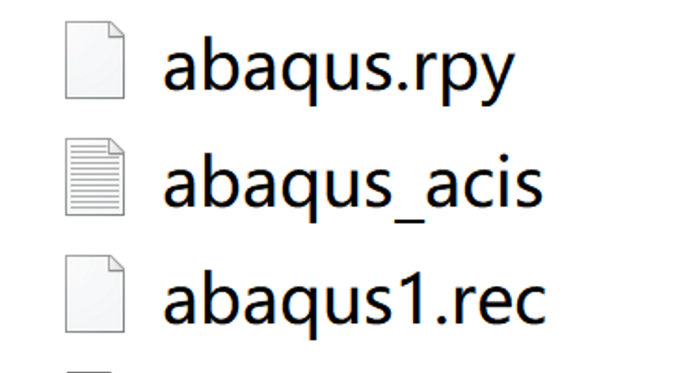​|​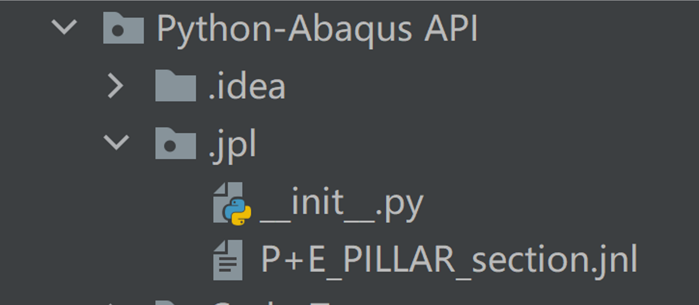​|

‍

The `"abaqus.rpy"`` `​can be automatically updatedaccording to action (checked in notebook++ and Pycharm)

By changing the parameters and process in it, we can obtain a new model with new job and analysis.

### 1.2 things to remember while writing the .py file

To be noticed that CAE can only run the plain python scripts in its run shell, which means that:

* Python scripts that have judgment statements (because prespace changes are not recognized)

* and 2) reference functions defined in the same file (CAE does not redirect to relative pathlookup) are not allowed to be imported into CAE to run

* => 3) Any references, function definitions and variable inputs need to be in the same script

### 1.3 How to create a model(Manually) in Abaqus

The abaqus modeling file mentioned is here:

(.pdf):

​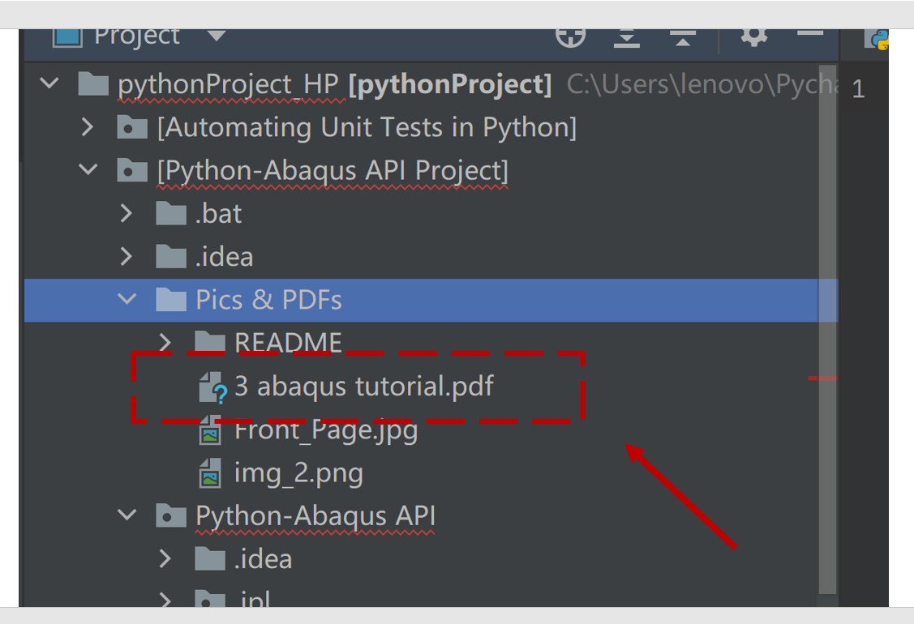​

(.mp4)

Abaqus Simulation Tutorial: [https://www.youtube.com/watch?v=KpGQT70EE-o](https://www.youtube.com/watch?v=KpGQT70EE-o)

## 2.Environment

### 2.1 Abaqus Environment: How to find the 'Abaqus Command' window to execute the .rpy scripts

Firstly we need to check where the 'Abaqus Command' window are.

|​​|C:\ProgramData\Microsoft\Windows\Start Menu\Programs\Dassault  Systemes SIMULIA Established Products 2021|
| -------------------------------------------------| -----------------------------------------------------------------------------------------------------------|

My path is in C:\ProgramData\Microsoft\Windows\Start Menu\Programs\Dassault Systemes SIMULIA Established Products 2021 =>  "Abaqus Command.lnk"

 To remember, you need to find the original `"Abaqus Command.lnk" 's location`​

The .lnk is the suffix for shortcut, to trace back to the original file, we can right click, then click on the `'Open file location'`​

> (How do I find the normal location of the shortcut?
>
> [https://m33.wiki/help/windows_shortcut_original_file_location.html](https://m33.wiki/help/windows_shortcut_original_file_location.html))

​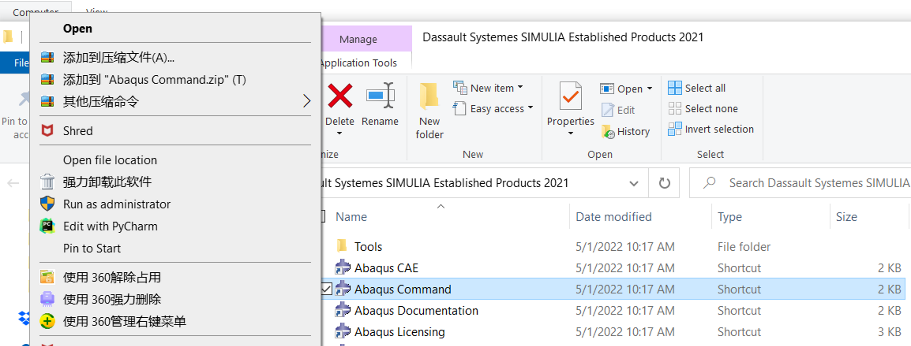​

​​

‍

## 3. Running Python scripts in Abaqus

### 3.1 Function structure and specification

The code structure contains the [Environmental Deploy] and [Script Execution]

​​

For now, we have the following scripts:

|​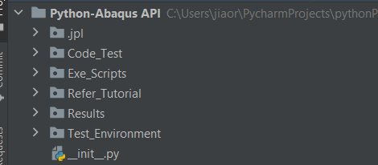​|Please see  the following pic|
| -------------------------------------------------| -------------------------------|

​​

###  3.2 Execute: Open [Abaqus Comman.lnk] and run the .py script

​![Open [Abaqus Comman.lnk] and run the .py script](assets/Open [Abaqus Comman.lnk] and run the .py script-20231203002238-zg4c0yl.png)​

​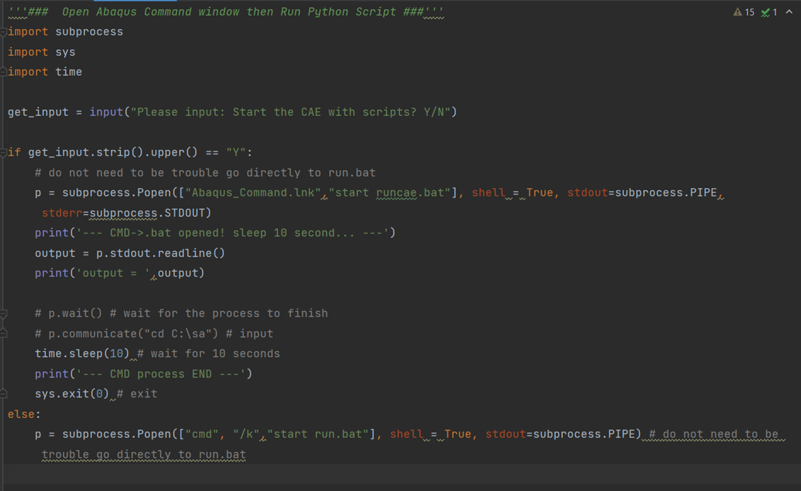​

You need to locate your execute scripts in the Abaqus Command window: Enter the Command in the Abaqus Command window:

''

> Cd C:\Users\jiaor\PycharmProjects\pythonProject_HP\Python-Abaqus API Project\Python-Abaqus API\Exe_Scripts
>
> abaqus cae script=Exe_1.py

''

I put them into a .bat file

​​

​​

To directly put the path into abaqus cae script **could not work**:

abaqus cae script=C:\Users\jiaor\PycharmProjects\pythonProject_HP\Python-Abaqus API Project\Python-Abaqus API\Exe_Scripts\Exe_1.py

Execute Scripts

### 3.3 Results Storage

​​

​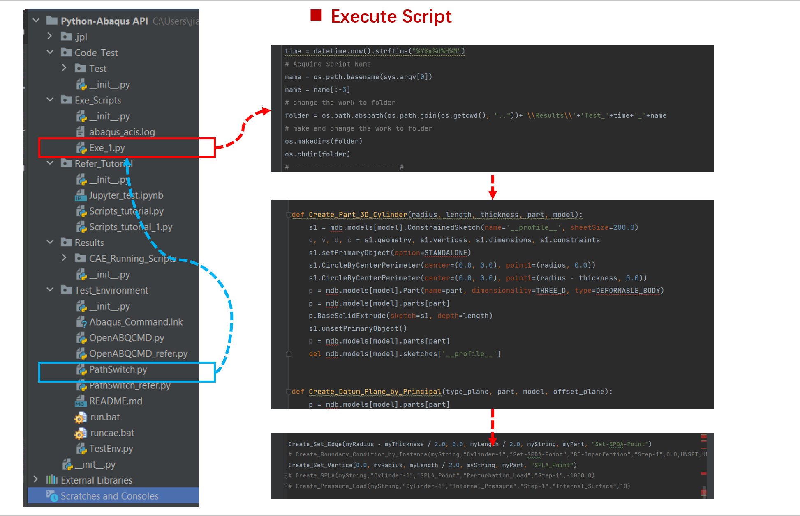​

 Finally, if you already setup the environment, simply click  TestEnv.py :

​​

​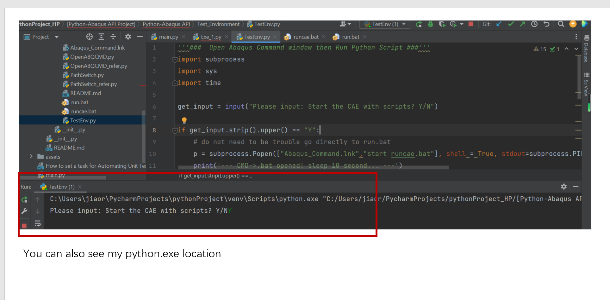​

An easy way to set up the environment and run the script is to put everything under the same folder, so the .py can find each other without setting.

### 3.4 Updates! How to select different execute scripts .py without re-write the runcae.bat?

If I want to change execute scripts 'name in the runcae.bat, or I have multiple scripts to run. How can I feed the variables to alter the .bat file?

> Codes:
>
> with open("testing.bat", "rt") as bat_file:
>
>     text = bat_file.readlines()
>
> new_text = []
>
> for line in text:
>
>     if "Exe_1.py" in line:
>
>         new_text.append(line.replace("Exe_1.py", "Exe_2.py"))
>
>     else:
>
>         new_text.append(line)
>
> with open("testing.bat", "wt") as bat_file:
>
>     for line in new_text:
>
>         bat_file.write(line)

(Please refer to this tutorial:

[Make changes to a .bat file using python](https://stackoverflow.com/questions/66453290/make-changes-to-a-bat-file-using-python)

From <[https://stackoverflow.com/questions/66453290/make-changes-to-a-bat-file-using-python](https://stackoverflow.com/questions/66453290/make-changes-to-a-bat-file-using-python)>

)

​​

​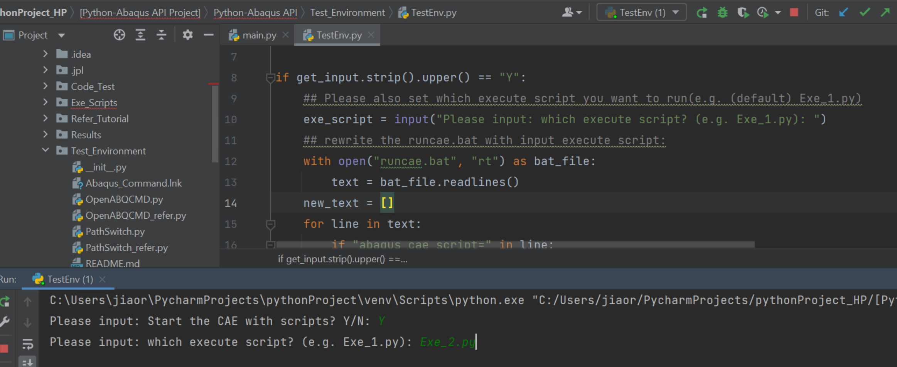​

## 4.Trimming your modeling scripts .py

When I running the scripts and it opens the Abaqus with the following error, which means the scripts can not build the corresponding modeling parts

​​

After repairing the codes, you can see the model has been set:

​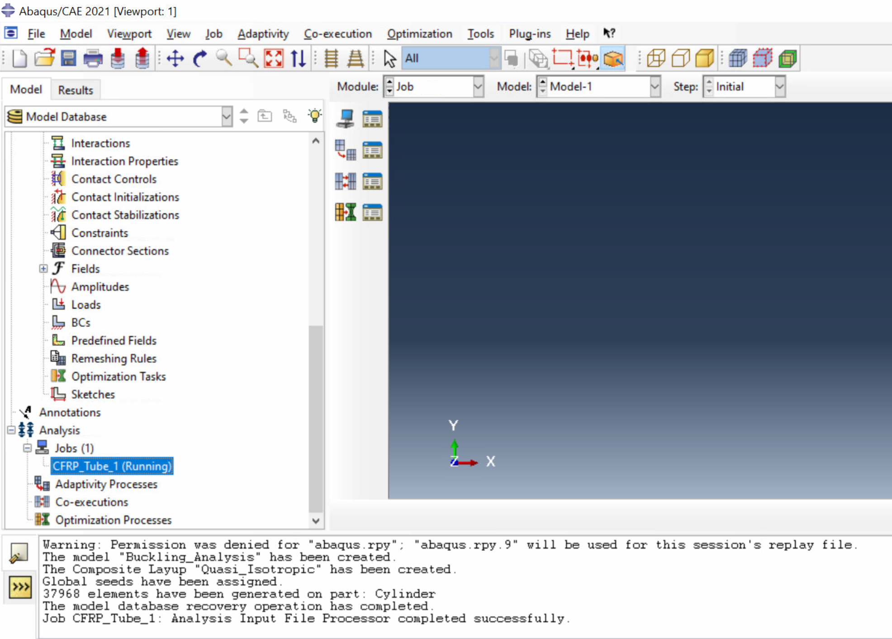​

The movement is recorded into .rpy file. If you want to rerun this model, you can copy this into the Abaqus prompt:

This .rpy recording every click you made in Abaqus.

​​

## 5.Export the data from Abaqus

### 5.1 how to export the analysis data through Python?

|Result  Types|Result  Name|How to  collect|
| :----------------------| :--------------------------------------------------| :------------------------------------------------------------------------|
|Abaqus  Data|[Output  Databases (1)] and [Model Database (2)]||
|Execute  movements|Abaqus.rpy.xx||
|Abaqus  modeling data|​​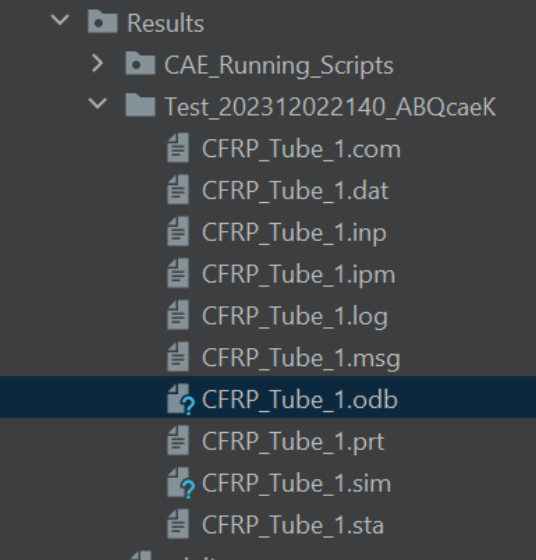​|Too  large for github. Might need to zip and upload to SQL/Google Drive|
||||
||||

From the following pictures, we can see there's two result we need to

​`[Output Databases (1)] and [Model Database (2)]`​

​​

‍

‍

The result cannot storage with Python as it's too large for github. Next step is to storage this into SQL

​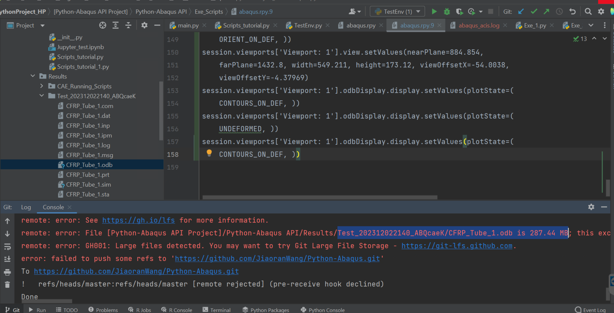​

Please refer to this:

[How to store a zip file in sql server table](https://stackoverflow.com/questions/28736692/how-to-store-a-zip-file-in-sql-server-table)

From <[https://stackoverflow.com/questions/28736692/how-to-store-a-zip-file-in-sql-server-table](https://stackoverflow.com/questions/28736692/how-to-store-a-zip-file-in-sql-server-table)>

‍

‍

‍

‍

‍

# References

From [https://blog.csdn.net/GeekLeee/article/details/73658311](https://blog.csdn.net/GeekLeee/article/details/73658311)

[refer CAE modeling:] [https://www.martinpletz.com/fe-scripting/](https://www.martinpletz.com/fe-scripting/)

[http://130.149.89.49:2080/v2016/books/cmd/default.htm?startat=pt01ch01.html](http://130.149.89.49:2080/v2016/books/cmd/default.htm?startat=pt01ch01.html) [http://130.149.89.49:2080/v6.11/pdf_books/SCRIPT_USER.pdf](http://130.149.89.49:2080/v6.11/pdf_books/SCRIPT_USER.pdf)

[Video]: [1] [https://www.youtube.com/watch?v=FbPBj7B4cKA](https://www.youtube.com/watch?v=FbPBj7B4cKA)

[code refer]:

[https://github.com/hnrwagner/ABAQUS-Python-Script/blob/main/Script_3D_cylinder_002.py](https://github.com/hnrwagner/ABAQUS-Python-Script/blob/main/Script_3D_cylinder_002.py) [https://github.com/hnrwagner/ABAQUS-Python-Script/blob/main/Script_3D_cylinder_004.py](https://github.com/hnrwagner/ABAQUS-Python-Script/blob/main/Script_3D_cylinder_004.py)

[2] [https://www.youtube.com/watch?v=QRQLliaOpm4](https://www.youtube.com/watch?v=QRQLliaOpm4)

‍
